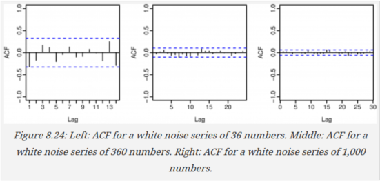

\pagebreak

HA - 8.1, 8.2, 8.6, 8.8

```{r dependencies, message=FALSE, warning=FALSE}
library(knitr)
library(fpp)

# Suppress messages and warnings in all chuncks
opts_chunk$set(message=FALSE, warning=FALSE)
```


## 8.1



**Figure 8.24 shows the ACFs for 36 random numbers, 360 random numbers and for 1,000 random numbers.**

### 8.1 (a)

**Explain the differences among these figures. Do they all indicate the data are white noise?**

These figures show the correlation between different lags of the series (shown on the x axis). The y axis (the correlation) has the same scale for each plot, but the x axis shows an increasing number of lags as the series gets longer.

If the data are white noise (random) then we expect the correlations to be below the blue line, which indicates a significant lag.

For all the plots, the correlations of the lags shown are all below the significance level so they are all indicitive of white noise.

### 8.1 (b)

**Why are the critical values at different distances from the mean of zero?**

The value of a significant correlation is $\pm 1.96/\sqrt{T}$ where T is the number of data. From this we can see that as the number of data increase the value of a significant correlation decreases.


## 8.2

**A classic example of a non-stationary series is the daily closing IBM stock prices (data set ibmclose). Use R to plot the daily closing prices for IBM stock and the ACF and PACF. Explain how each plot shows the series is non-stationary and should be differenced.**

```{r fig.height=6}
data(ibmclose)
tsdisplay(ibmclose)
```

When the ACF is slowly decaying, as it is in the graph above, it is a sign that the series may be auto regressive. We then look to the PACF to tell us of what degree. In this case we expect an AR(1) process that will need to be differenced once to be made stationary.

## 8.6

**Consider the number of women murdered each year (per 100,000 standard population) in the United States (data set wmurders).**

### 8.6 (a)

**By studying appropriate graphs of the series in R, find an appropriate ARIMA($\mathbf{p, d, q}$) model for these data.**

```{r}
data(wmurders)

tsdisplay(wmurders)
```

This is clearly not stationary. Let's start with taking the first difference.


```{r}
wmurders.d1 <- diff(wmurders)
tsdisplay(wmurders.d1)
```

This looks much better, but the ACF and PACF still show some significant spikes at a lag of two. Let's try a unit root test:

```{r}
adf.test(wmurders.d1)
kpss.test(wmurders.d1)
```

These tests are telling us different things. An ADF test $< 0.5$ indicates a stationary series, but a KPSS test $< 0.5$ indicates a non-stationary series. Take another difference and see what happens:

```{r}
wmurders.d2 <- diff(diff(wmurders))

tsdisplay(wmurders.d2)

# unit root tests
adf.test(wmurders.d2)
kpss.test(wmurders.d2)
```

Now both unit root tests tell us we have a stationary series.

Looking at the ACF and PACF plots, the large spike at 1 tells us we need either *p* or *q* to be 1. Let's start with $p=1$ and test several ARIMA models in that neighborhood:

```{r}
test.arima <- function(t.series, order){
  df <- data.frame(model=paste0("ARIMA(", 
                                paste0(order, collapse=","), 
                                ")"),
                   AICc=Arima(t.series, order=order)$aicc)
  return(df)
}

df <- test.arima(wmurders.d2, c(1, 2, 0))
df <- rbind(df,
            test.arima(wmurders, c(1, 2, 1)),
            test.arima(wmurders, c(2, 2, 0)),
            test.arima(wmurders, c(1, 1, 1)),
            test.arima(wmurders, c(0, 1, 1)),
            test.arima(wmurders, c(1, 1, 0)),
            test.arima(wmurders, c(0, 1, 0)))
kable(df)
```

Trying several models, including several with $d=1$, we find the model with the lowest AICc to be `r df[df$AICc == min(df$AICc), "model"]`

Let's fit this model and test the residuals:

```{r}
fit <- Arima(wmurders, order=c(0, 1, 0))
tsdisplay(residuals(fit), lag.max=20)
```

We see in the ACF and PACF the small spike at lag 2.  Since it is  only one this might be okay. Let's do a portmanteau test:

```{r}
Box.test(residuals(fit), lag=24, fitdf=4, type="Ljung")
```

The portmanteau test indicates the residuals are white noise so we conclude that the best model is ARIMA(0, 1, 0) - a random walk.

Note: The auto.arima function returns ARIMA(1, 2, 1) as the best model. We see in out table that the AICc for that model is -6.4 while the AICc for the model we selected is -11.4. As long as the residuals look okay, I don't see why we wouldn't go with the model with the lower AICc.

### 8.6 (b)

**Should you  include a constant in the model? Explain.**

No. A constant introduces drift into the model, which we do not appear to have in these data.

### 8.6 (c)
**Write this model in terms of the backshift operator.**

$$(1-B)\;y_t = 0$$

### 8.6 (d)

**Fit the model using R and examine the residuals. Is the model satisfactory?

(see above)

### 8.6 (e)

**Forecast three times ahead. Check your forecasts by hand to make sure you know how they have ben calculated.**

```{r}
fcast <- forecast(fit, h=3)
fcast$mean
```


### 8.6 (f)
**Create a plot of the series with forecasts and prediction intervals for the next three periods shown.**

```{r}
plot(fcast)
```


### 8.6 (g)
**Does auto.arima give the same model you have chosen? If not, which model do you think is better?**

```{r}
auto.arima(wmurders)
```


As I said above, the auto.arima function returns ARIMA(1, 2, 1) as the best model. We see in out table that the AICc for that model is -6.4 while the AICc for the model we selected is -11.4. As long as the residuals look okay, I don't see why we wouldn't go with the model with the lower AICc.


## 8.8

**Consider the total net generation of  electricity (in billion kilowatt hours) by the U.S. electric industry (monthly for  the period 1985-1996). (Data set usmelec.) In general there are two peaks per year: in mid-summer and mid-winter.

### 8.6 (a)

**Examine the 12-month moving average of this series to  see what kind of trend is involved.**


### 8.6 (b)

**Do the data need transformin? If so, find a suitable transformation.**


### 8.6 (c)

**Are the data stationary? If not, find an appropriate differencing which yields stationary data.**


### 8.6 (d)

**Identify a couple of  ARIMA models thatmighht be useful in describing the time series. Which of your models is the best according to their AIC values?**

### 8.6 (e)

**Estimate the parameters of your best model and do diagnostic testing on the residuals. Do the residuals resemble white noise? If not, try to find another ARIMA model which fits better.**

### 8.6 (f)

**Forecast the next 15 years of generation of electricity by the U.S. electric industry. Get the latest figures from http://data.is/zgRWCO to check on the accuracy of your forecasts.**


### 8.6 (g)

**How many years of forecasts do you tink are sufficiently accurate to be usable?**


